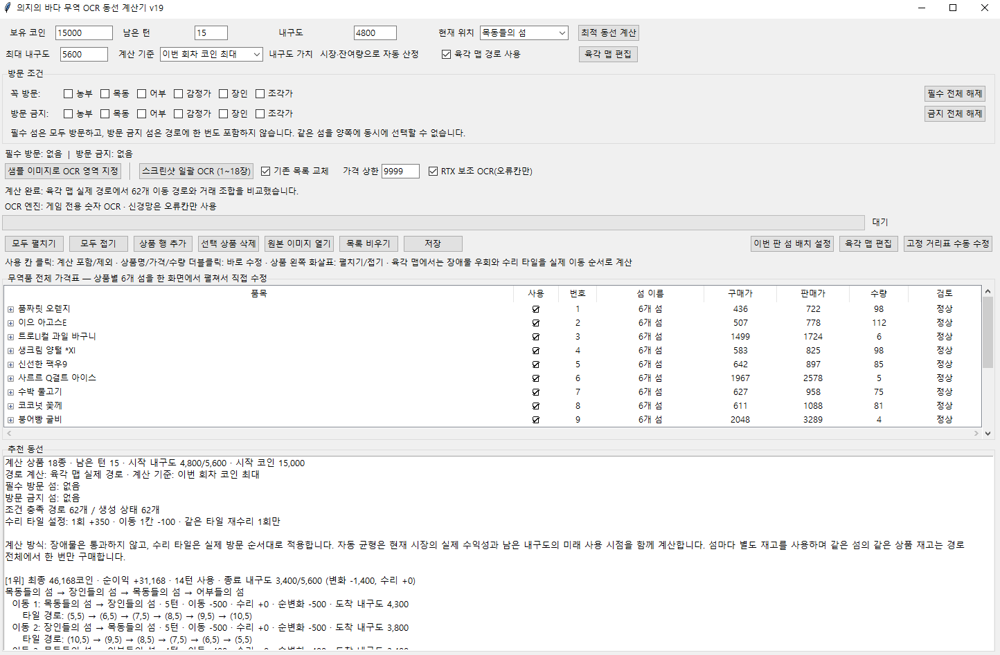
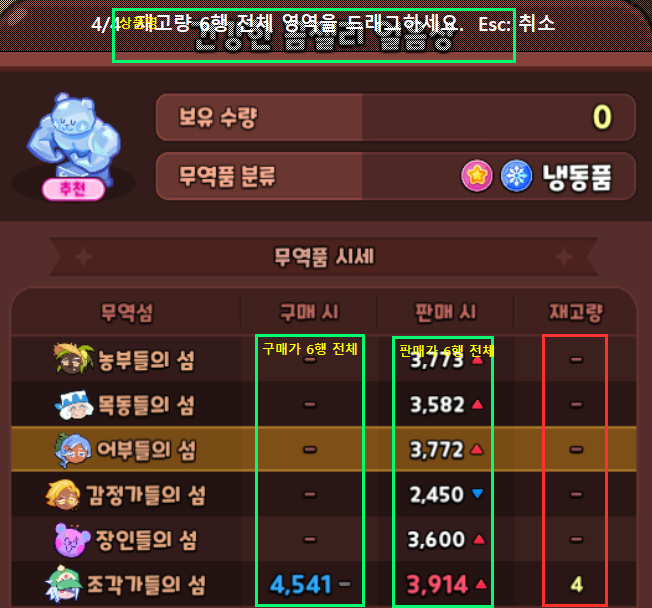
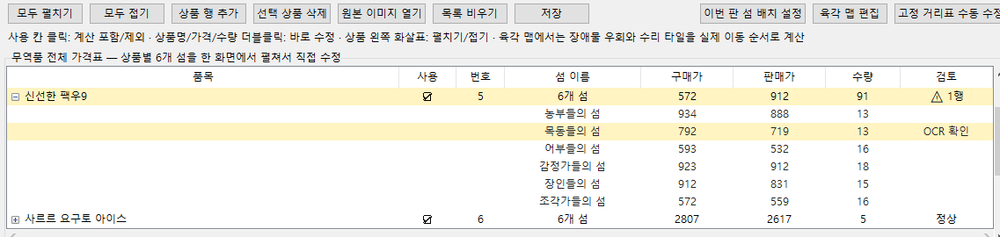
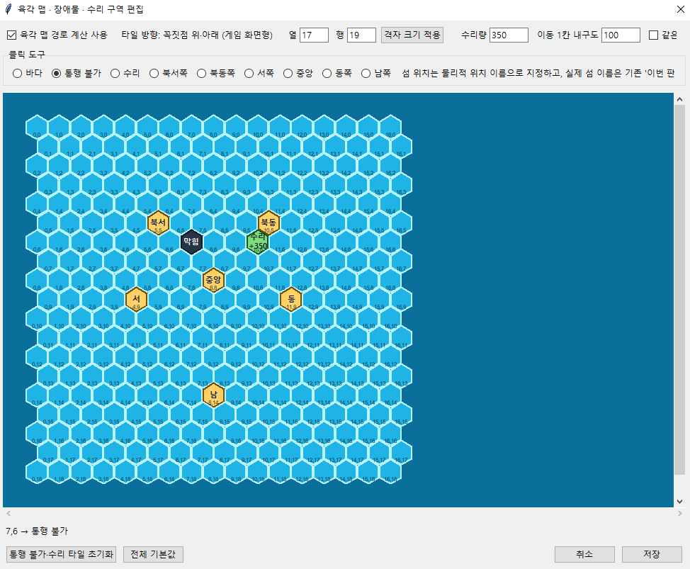
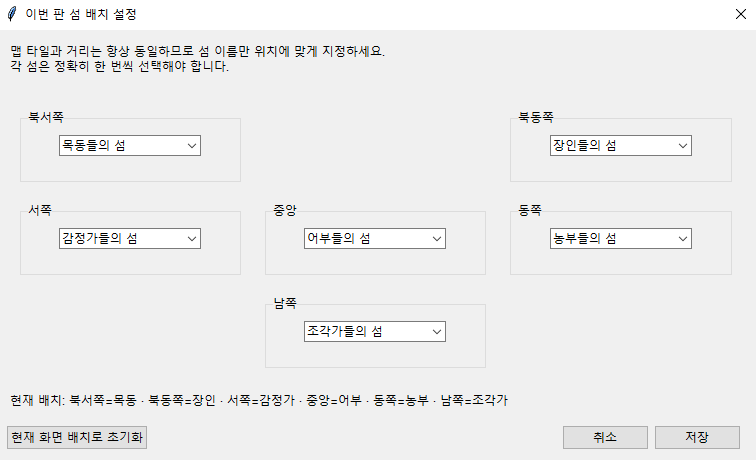

# 영광의 항로 OCR 동선 계산기 v21
### 의지의 바다 무역 동선 계산기 v21

게임의 무역품 가격과 재고를 OCR로 읽고, 현재 코인·턴·내구도·섬 위치를 기준으로  
수익이 높은 구매·판매 동선을 계산하는 비공식 보조 프로그램입니다.

<p align="center">
  
</p>

---

## 다운로드

GitHub의 **Releases**에서 아래 두 버전 중 하나를 받으면 됩니다.

### 바로 사용 EXE판

파일명:

```text
SeaTradePlanner_v21_.EXE.zip
````

* Python 설치가 필요하지 않습니다.
* ZIP 파일을 완전히 압축 해제합니다.
* 압축을 푼 폴더 안의 `SeaTradePlanner_v21.exe`를 실행합니다.
* EXE 파일과 함께 들어 있는 `_internal` 폴더를 삭제하거나 옮기면 실행되지 않습니다.
* 일반 사용자에게 추천하는 버전입니다.
* 기본 CPU OCR을 사용합니다.

### Python 자동 설치판

파일명:

```text
SeaTradePlanner_v21_Python_Setup.zip
```

* 최초 실행 시 Python 3.11과 필요한 패키지를 자동으로 설치합니다.
* 최초 설치에는 인터넷 연결이 필요합니다.
* NVIDIA GPU 보조 OCR을 선택적으로 사용할 수 있습니다.
* 프로그램 수정, 패치 적용, GPU OCR 사용이 필요한 경우 추천합니다.

### 버전 선택

| 구분         | EXE 바로 사용판      | Python 자동 설치판           |
| ---------- | --------------- | ----------------------- |
| Python 설치  | 필요 없음           | 최초 실행 시 자동 설치           |
| 인터넷 연결     | 필요 없음           | 최초 설치 시 필요              |
| 실행 방법      | EXE 실행          | `SETUP.cmd` 후 `RUN.cmd` |
| GPU 보조 OCR | 기본 미포함          | NVIDIA 선택 지원            |
| 업데이트 방식    | 새 EXE ZIP 재다운로드 | 패치 파일 덮어쓰기 가능           |
| 추천 대상      | 일반 사용자          | GPU 및 수정 사용자            |

---

## 목차

1. [주요 기능](#주요-기능)
2. [EXE판 설치 및 실행](#exe판-설치-및-실행)
3. [Python판 설치 및 실행](#python판-설치-및-실행)
4. [OCR 사용법](#ocr-사용법)
5. [육각 맵 사용법](#육각-맵-사용법)
6. [최적 동선 계산](#최적-동선-계산)
7. [도착 후 실시간 변수 재계산](#도착-후-실시간-변수-재계산)
8. [계산 기준](#계산-기준)
9. [GPU 보조 OCR](#gpu-보조-ocr)
10. [저장 파일](#저장-파일)
11. [오류 해결](#오류-해결)
12. [주의사항](#주의사항)
13. [면책 안내](#면책-안내)

---

## 주요 기능

* 무역품 스크린샷 일괄 OCR
* 구매가·판매가·재고 자동 인식
* 구매 불가 `-` 자동 판정
* OCR 이상값 노란색 표시
* 필수 방문 섬 및 방문 금지 섬 설정
* 통행 불가 타일 우회 계산
* 수리 타일과 회복량 반영
* 남은 턴 정박 내구도 반영
* 마지막 섬 수리 타일 왕복 계산
* 섬 재방문 경로 계산
* 중간 판매대금 재투자
* 코인 최대·자동 균형·종료 내구도 우선 계산
* 도착 후 실시간 가격 변동 재계산
* 설정과 가격표 자동 저장

---

## EXE판 설치 및 실행

사용 파일:

```text
SeaTradePlanner_v21_.EXE.zip
```

1. ZIP 파일의 압축을 완전히 풉니다.
2. 압축을 푼 폴더를 원하는 위치로 옮깁니다.
3. `SeaTradePlanner_v21.exe`를 실행합니다.
4. Windows 보호 창이 표시되면 파일 출처를 확인한 뒤 실행 여부를 선택합니다.

### EXE판 주의사항

다음 파일과 폴더를 삭제하거나 따로 옮기면 안 됩니다.

```text
SeaTradePlanner_v21.exe
_internal
config.json
trade_data.json
기타 포함 파일
```

EXE만 바탕화면으로 옮기지 말고, 바로가기를 만들어 사용하는 것이 좋습니다.

EXE판을 업데이트할 때는 새 버전 ZIP을 다시 받은 뒤 기존의 다음 파일을 백업해 옮기세요.

```text
config.json
trade_data.json
```

---

## Python판 설치 및 실행

사용 파일:

```text
SeaTradePlanner_v21_Python_Setup.zip
```

1. ZIP 파일의 압축을 완전히 풉니다.
2. 인터넷에 연결된 상태에서 `SETUP.cmd`를 실행합니다.
3. Python 3.11이 없으면 자동으로 설치합니다.
4. 필요한 OCR 및 계산 패키지를 자동으로 설치합니다.
5. 설치가 끝나면 프로그램이 실행됩니다.
6. 다음부터는 `RUN.cmd`로 실행합니다.
7. 오류가 발생하면 `DIAGNOSE.cmd`를 실행합니다.

일반적으로 Python을 따로 설치할 필요는 없습니다.

다만 PC에 `winget`이 없으면 Python 자동 설치가 진행되지 않을 수 있습니다.
이 경우 Python 3.11 64비트를 직접 설치한 뒤 `SETUP.cmd`를 다시 실행하세요.

---

## OCR 사용법

### 1. OCR 영역 지정

`샘플 이미지로 OCR 영역 지정`에서 다음 영역을 각각 지정합니다.

* 상품명
* 구매가
* 판매가
* 재고량

<p align="center">
  
</p>

### 2. 스크린샷 준비

스크린샷은 항상 다음 조건을 맞추는 것이 좋습니다.

* 같은 해상도
* 같은 UI 배율
* 같은 위치
* 같은 크기
* 가격표가 가려지지 않은 화면

고정 영역 캡처가 가능한 `ezCapture`, `칼무리` 등의 프로그램을 사용할 수 있습니다.

### 3. 일괄 OCR

무역품 스크린샷을 한 번에 선택해 일괄 OCR합니다.

숫자는 게임 전용 숫자 템플릿으로 먼저 판독하고,
확신도가 낮은 칸만 정밀 OCR로 다시 확인합니다.

### 4. OCR 결과 확인

노란색으로 표시된 값은 원본 이미지를 확인한 뒤 직접 수정하세요.

<p align="center">
  
</p>

노란색 표시 대상:

* 주변 가격과 비교해 지나치게 높거나 낮은 값
* OCR 확신도가 낮은 값
* 숫자 일부가 빠졌을 가능성이 있는 값
* 비정상적으로 높은 재고량

---

## 육각 맵 사용법

### 1. 육각 맵 편집

`육각 맵 편집`을 엽니다.

### 2. 타일 종류 지정

각 타일을 다음 중 하나로 설정합니다.

* 바다
* 통행 불가
* 수리
* 북서쪽 섬
* 북동쪽 섬
* 서쪽 섬
* 중앙 섬
* 동쪽 섬
* 남쪽 섬

<p align="center">
  
</p>

### 3. 내구도 설정

다음 값을 입력합니다.

* 수리 타일 1회 방문 시 회복량
* 이동 1칸당 내구도 소모량
* 같은 수리 타일 재방문 시 다시 수리할지 여부

### 4. 이번 판 섬 배치 설정

`이번 판 섬 배치 설정`에서 각 위치의 실제 섬 이름을 선택합니다.

<p align="center">
  
</p>

### 5. 육각 맵 경로 사용

메인 화면에서 `육각 맵 경로 사용`을 체크한 뒤 계산합니다.

통행 불가·수리 타일만 지우려면
`통행 불가·수리 타일 초기화` 버튼을 사용합니다.

다음 항목은 유지됩니다.

* 섬 위치
* 섬 이름 배치
* 육각 맵 크기
* 나머지 프로그램 설정

---

## 최적 동선 계산

### 현재 상태 입력

다음 정보를 입력합니다.

* 현재 보유 코인
* 남은 턴
* 현재 내구도
* 최대 내구도
* 현재 위치한 섬
* 정박 1턴당 내구도 소모량

정박 내구도의 기본값은 `80`입니다.

### 방문 조건 설정

필요한 경우 다음 조건을 선택합니다.

* 반드시 방문할 섬
* 방문하지 않을 섬
* 계산에 사용할 상품

### 계산 결과

결과에는 다음 내용이 표시됩니다.

* 이동할 섬 순서
* 상품별 구매 수량
* 상품별 판매 위치
* 예상 순이익
* 최종 보유 코인
* 사용 턴
* 이동 내구도 소모
* 수리 타일 회복량
* 정박 내구도 소모
* 회차 종료 내구도
* 마지막 섬 수리 타일 왕복 여부

프로그램은 무역을 일찍 마친 경우 다음 두 방법도 비교합니다.

```text
바로 정박하기
수리 타일을 방문하고 마지막 섬으로 복귀한 뒤 정박하기
```

수리 왕복 후 내구도가 더 많이 남는다면 해당 경로를 추천합니다.

---

## 도착 후 실시간 변수 재계산

처음 계산한 동선을 따라 이동하던 중 가격이나 구매 가능 여부가 바뀌면
`도착 후 변수 재계산` 기능을 사용합니다.

예시:

```text
처음 계획: A → B → C → D

B 도착 후 확인:
특정 상품 구매 불가
특정 상품 판매가격 2배
```

### 사용 순서

1. 기존 추천 결과에서 실제로 따라간 경로를 선택합니다.
2. `도착 후 변수 재계산`을 누릅니다.
3. 현재 도착한 섬을 선택합니다.
4. 변동이 발생한 상품을 선택합니다.
5. 필요한 변동값을 입력합니다.

   * 구매 불가
   * 판매 배수
   * 실제 판매가격
6. 현재 남은 상태부터 다시 계산합니다.

### 자동으로 이어받는 정보

* 현재 보유 코인
* 이전 섬에서 구매한 보유 화물
* 이미 사용한 섬별 재고
* 남은 턴
* 현재 내구도
* 이미 방문한 수리 타일
* 이미 충족한 필수 방문 섬

실제 판매가격과 판매 배수를 함께 입력하면 실제 판매가격을 우선 적용합니다.

입력한 실시간 변동값은 해당 재계산에만 사용되며,
기본 가격표인 `trade_data.json`에는 저장되지 않습니다.

---

## 계산 기준

### 이번 회차 코인 최대

현재 회차에서 최종 코인이 가장 높은 경로를 우선합니다.

### 자동 균형

현재 시장의 수익성, 남은 내구도, 수리 효과와 정박 비용을 분석해
코인과 내구도를 함께 평가합니다.

### 종료 내구도 우선

계산 종료 후 내구도가 가장 많이 남는 경로를 우선합니다.

내구도가 같으면 코인이 더 높은 경로를 표시합니다.

---

## GPU 보조 OCR

기본 숫자 OCR은 CPU에서 빠르게 처리됩니다.

GPU는 확신도가 낮은 숫자와 상품명의 정밀 재검사에만 사용됩니다.

### NVIDIA 그래픽카드

GPU 보조 OCR은 Python 자동 설치판에서 사용합니다.

1. `SETUP.cmd` 설치를 완료합니다.
2. `GPU_OCR_SETUP.cmd`를 최초 1회 실행합니다.
3. 프로그램에서 `RTX 보조 OCR(오류칸만)`을 체크합니다.
4. `DIAGNOSE.cmd`에서 `CUDAExecutionProvider`가 표시되는지 확인합니다.

### 지원 범위

* NVIDIA RTX: GPU 사용 가능
* 일부 NVIDIA GTX: CUDA 지원 여부에 따라 사용 가능
* AMD Radeon: CPU OCR 사용
* Intel Arc 및 내장 그래픽: CPU OCR 사용
* GPU 설치 실패: 자동으로 CPU OCR 사용

GPU를 사용하지 않아도 기본 OCR과 동선 계산 기능은 정상적으로 작동합니다.

---

## 저장 파일

### `config.json`

다음 설정이 저장됩니다.

* OCR 영역
* 섬 배치
* 육각 맵
* 통행 불가 및 수리 타일
* 수리량
* 이동 내구도
* 방문 조건
* 계산 기준

### `trade_data.json`

다음 정보가 저장됩니다.

* 상품명
* 구매가
* 판매가
* 재고
* 상품 사용 여부
* 원본 이미지 경로

### 오류 로그

```text
startup_error.log
runtime_error.log
```

* `startup_error.log`: 프로그램 시작 오류
* `runtime_error.log`: 실행 중 오류

---

## 오류 해결

### EXE판이 실행되지 않는 경우

* ZIP 파일을 완전히 압축 해제했는지 확인합니다.
* EXE와 `_internal` 폴더가 같은 위치에 있는지 확인합니다.
* EXE만 다른 폴더로 옮기지 않았는지 확인합니다.
* Windows 보안 프로그램에서 차단했는지 확인합니다.

### Python판이 실행되지 않는 경우

1. `DIAGNOSE.cmd`를 실행합니다.
2. `startup_error.log`와 `runtime_error.log`를 확인합니다.
3. `SETUP.cmd`를 다시 실행합니다.

### OCR 정확도가 낮은 경우

* 게임 해상도와 UI 배율을 확인합니다.
* 같은 위치와 같은 크기로 캡처합니다.
* OCR 영역을 다시 지정합니다.
* 가격표 위에 마우스 커서나 다른 창이 겹치지 않게 합니다.
* 노란색으로 표시된 값을 직접 확인합니다.

---

## 주의사항

* OCR 영역은 게임 해상도나 UI 배율이 바뀌면 다시 지정해야 할 수 있습니다.
* 스크린샷은 동일 구역과 동일 크기로 준비하는 것이 좋습니다.
* 노란색으로 표시된 값은 계산 전에 원본과 비교해 확인하세요.
* 게임 업데이트로 글꼴이 바뀌면 숫자 템플릿의 정확도가 낮아질 수 있습니다.
* 장애물과 수리 타일은 자동으로 인식하지 않으므로 직접 지정해야 합니다.
* 게임에서 맵 배치가 바뀌면 섬 위치와 장애물 위치를 다시 확인하세요.
* 계산 결과는 입력한 가격표와 맵 정보가 정확하다는 전제에서만 유효합니다.
* 프로그램을 옮기거나 업데이트할 때 `config.json`과 `trade_data.json`을 백업하세요.
* 자동 클릭, 자동 이동, 자동 구매 및 판매 기능은 포함되어 있지 않습니다.

---

## 면책 안내

* 본 프로그램은 개인이 제작한 비공식 보조 도구이며 게임의 개발사 및 운영사와 관련이 없습니다.
* 게임명, 이미지, UI, 글꼴 및 기타 게임 관련 자료의 권리는 각 권리자에게 있습니다.
* 본 프로그램은 사용자가 직접 제공한 화면을 OCR로 분석하고 경로를 계산하는 용도로만 제공됩니다.
* 게임 프로세스, 메모리, 네트워크 패킷 및 게임 설치 파일을 읽거나 변경하지 않습니다.
* 키보드·마우스 입력, 이동, 구매 및 판매를 자동으로 수행하지 않습니다.
* OCR 결과와 추천 경로의 정확성 및 수익을 보장하지 않습니다.
* 사용자는 계산 전에 가격, 재고, 섬 배치와 이동 경로를 직접 확인해야 합니다.
* 프로그램 사용으로 발생하는 오인식, 게임 내 손실 또는 계정 관련 문제의 책임은 사용자에게 있습니다.
* 사용 전 해당 게임의 운영정책과 이용약관을 확인하고 준수해 주세요.

````
